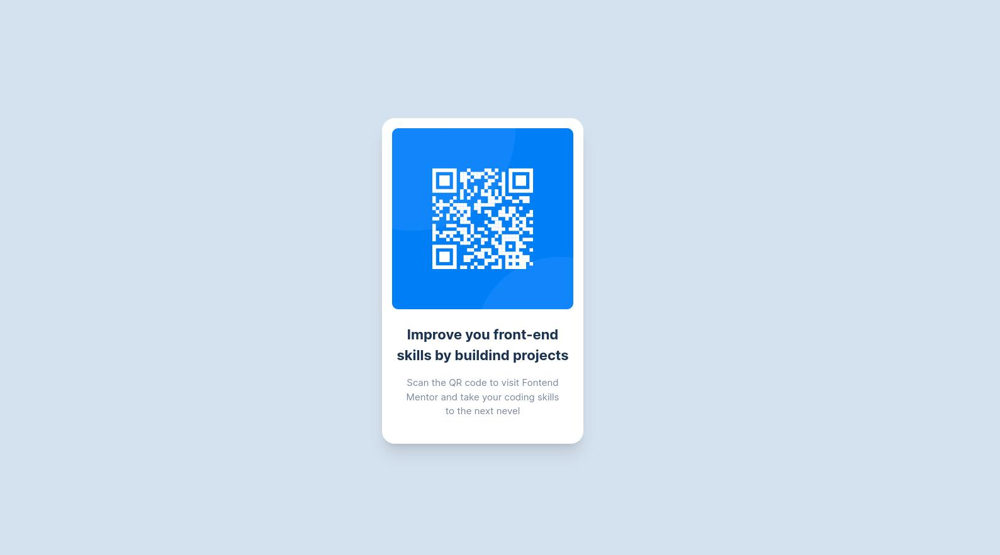

# Frontend Mentor - QR code component solution

This is a solution to the [QR code component challenge on Frontend Mentor](https://www.frontendmentor.io/challenges/qr-code-component-iux_sIO_H). Frontend Mentor challenges help you improve your coding skills by building realistic projects. 

## Table of contents

- [Frontend Mentor - QR code component solution](#frontend-mentor---qr-code-component-solution)
  - [Table of contents](#table-of-contents)
    - [Screenshot](#screenshot)
    - [Links](#links)
    - [Built with](#built-with)

**Note: Delete this note and update the table of contents based on what sections you keep.**

### Screenshot

### Links

- Solution URL: [https://www.frontendmentor.io/solutions/html-css-grid-flexbox-and-tailwindcss-FcX9ZXDXcX](https://www.frontendmentor.io/solutions/html-css-grid-flexbox-and-tailwindcss-FcX9ZXDXcX)
- Live Site URL: [https://master--incredible-cuchufli-c32228.netlify.app](https://master--incredible-cuchufli-c32228.netlify.app)

### Built with

- Semantic HTML5 markup
- CSS custom properties
- Flexbox
- CSS Grid
- Mobile-first workflow
- [Tailwind](https://tailwindcss.com//)
